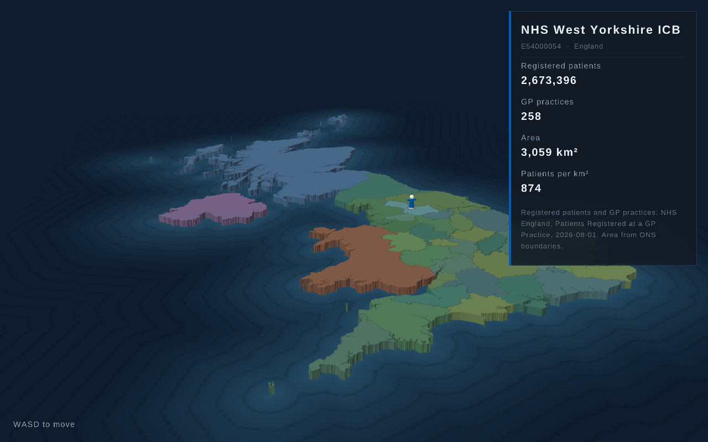

# UK 3D map

An extruded 3D map of the UK — England's 36 NHS Integrated Care Boards as
bevelled slabs, the devolved nations as single blobs — sitting in a charted
ocean, with a figure you can walk around it. Odin + `vendor:raylib`.



## Run

```sh
make run     # debug build + run
make build   # optimised binary -> ./ukmap
make test    # walker and land-grid tests
make serve   # WebAssembly build, served on :8000
./ukmap
```

Run from the repo root: the assets are loaded from `assets/` relative to the
working directory.

| input | |
|---|---|
| WASD (+ shift) | walk / run, relative to the camera |
| drag / arrow keys | orbit |
| right-drag | slide the map |
| wheel | zoom |
| tab | follow camera on/off |
| space | focus: show only the ICB he is in |
| P | region panel on/off |
| R | reset view and walker |
| Esc | quit |

Only "WASD to move" is drawn on screen — the other keys above are deliberately
not listed there. The side panel is open by default and names the region he is
standing in, and that region is subtly brightened on the map. He cannot walk off
the coast — pushing into it slides him along it instead.

`./ukmap --shot out.png` renders one frame, writes the PNG and exits.

## How it works

The boundary data is a preprocessing problem, not a runtime one, so it is baked
into a flat mesh ahead of time.

**`tools/build_mesh.py`** reads the GeoJSON boundaries, and for each ring:

1. projects lon/lat equirectangularly around 54.5°N, 3°W (good enough over a
   1000 km span) and drops islands under 1 km²,
2. simplifies with Douglas-Peucker at a 200 m tolerance,
3. insets the ring to get the top face, and extrudes down to the uninset
   footprint at `y = 0` — the resulting bevel is what draws the borders.
   Neighbouring regions touch at the base, so there are no cracks to see
   through, but their top faces are separated by a shaded slope,
4. triangulates the top face with earcut (`tools/earcut.py`, a pure-python port —
   no third-party deps),
5. bakes a directional light into the vertex colours, tinted per country and
   jittered slightly per region. The ICBs cycle a green/teal palette; the
   devolved nations keep a flat colour each.

A naive inset folds over itself wherever a shape is narrower than twice the
bevel — small islands, thin peninsulas, spits — and a folded ring triangulates
into overlapping garbage that leaves see-through holes in the slab. So each
candidate inset is checked two ways (it must keep most of its area, and its
triangulation must cover it exactly), backing off by halves until one passes.
59 rings end up too thin to bevel at all and get vertical walls instead.

The result is one non-indexed mesh (~100k triangles, 8.4 MB) in a flat binary
described at the top of `build_mesh.py`. **`mesh.odin`** memcpys the three arrays
into raylib-owned buffers, uploads once, and the render loop is a single
`DrawModel`. Lighting being baked means raylib's default unlit shader is all
that's needed.

### Highlighting the current region

The map is one baked mesh, so lighting up a single region means rewriting that
region's vertex colours in place. `build_mesh.py` therefore records each region's
vertex range in the mesh header, in the same order as the land grid's region
indices; `uk_set_highlight` brightens that range and restores whichever was lit
before, re-uploading only the two affected slices rather than the whole
300k-vertex buffer.

The lift is a brightness multiply (×1.35), not a lerp towards white. Lerping
washes the colour out and the region stops reading as its own — the first attempt
turned West Yorkshire grey.

### The ocean

The water is a single textured quad at `y = 0.09`, so the coasts stand about two
thirds of the slab height out of it, plus a large flat plane in the deepest
colour underneath so the sea does not stop at the texture's edge.

The texture is baked, not shaded. `build_mesh.py` scan-converts the regions onto
a padded, coarser grid, runs a two-pass chamfer distance transform out from the
land, and maps distance-from-shore to a colour ramp with a darker contour every
25 km. That is what makes it read as a chart rather than a flat blue: the bands
follow the real coastline, shelf first and then deep water.

Baking it is the point. A water *shader* would look better still, but it would
need one variant for desktop GL 3.3 and another for the WebGL/GLES2 build; a
textured quad behaves identically on both. 339×512 texels, 0.7 MB.

One trap worth recording: `DrawPlane` goes through rlgl's batch and only flushes
at `EndMode3D`, so it can be drawn *after* the quad despite being issued first.
The deep plane therefore sits 0.02 below the texture, not a hairline below it —
otherwise the two z-fight and the flat colour wins.

### The walker

The mesh is anonymous triangles — nothing in it knows where the coast is. So the
builder also scan-converts the region footprints into `assets/uk.land`: a
565×1024 grid at ~1.2 km per cell holding a region index per cell, 0 for sea,
with the region names appended. 1.2 MB, and `land_at(x, z)` is an array lookup
rather than a raycast against 100k triangles. It answers "is this land?" and
"which region is this?" in one go, which is where the HUD label comes from.

(Sanity check on the rasteriser: 170,344 land cells × 1.43 km² ≈ 243,000 km²,
against the UK's actual 242,500 km².)

The top of the slab is flat and all regions share a height, so walking is just
X/Z movement at a fixed Y. Movement is camera-relative, and a blocked step is
retried one axis at a time so the coast is slid along rather than stuck against.

At this scale one world unit is about 61 km, so a person would be far under a
pixel. The figure is a board-game piece — roughly as tall as the slab is thick —
not a man in a landscape, and it is that same size wherever it stands: the
country is the thing with a scale on it, and a piece that grew and shrank as you
walked read as a bug.

Focus mode is the one exception, and it moves both sizes and his pace. Alone on screen a
small ICB has nothing to be compared against, so the slab is squashed towards
55% of its thickness as the region gets smaller (South West London is 0.27 world
units across against Scotland's 4.7), and the figure is cut to as little as 30%
of full — at full size he is taller than that borough is wide. Both are drawing
scales only, eased in and out; the mesh on disk is one uniform thickness.

Walking speed goes with it. At the full 1.6 units per second he crosses South
West London in a sixth of a second, which zoomed in is a blur, so while he is
penned in an ICB his speed is scaled by that region's size against NHS Norfolk
and Suffolk ICB. Every ICB then takes the same second or so to cross, whatever
it is; regions bigger than the reference keep full speed and simply take longer.

He wears the NHS identity colours (`#005eb8` blue, white), taken from the
[NHS digital service manual](https://service-manual.nhs.uk/design-system/styles/colour).
The white plinth and head are not decoration: an all-blue piece disappears
against the blue sea and the Scotland blob when you zoom out to the whole
country.

`figure.odin` builds the whole figure as a mesh with lighting baked into the
vertex colours, against the same light direction the map uses — same reason as
the ocean, a real light would need separate GL 3.3 and WebGL shaders. Its ambient
is lifted to 0.62 from the map's 0.42; at the map's value the white parts read as
grey.

The model is rotated to face his direction of travel, which would normally drag
the baked highlight round with him. So instead the light is rotated *into model
space* by the opposite angle and the colours are re-baked whenever he turns —
one small colour-buffer upload per turn, and the highlight stays put in the
world where the eye expects it.

The nose is deliberately a stubby snout protruding about half a head radius.
The first version was a long thin cone: fine head-on, but from side-on it read
as a bird's beak.

### The side panel

A panel describing whichever region he is standing in, open by default and
toggled with `P`. Its content is
data, not code — `data/regions.tsv`:

```
# Registered patients and GP practices: NHS England, ... Area from ONS boundaries.
code       name                    Registered patients  GP practices  Area       ...
E54000054  NHS West Yorkshire ICB  2,673,396            258           3,059 km²  ...
```

A leading `#` line is a comment, and the first one is drawn as the panel's
footnote — so the data states its own provenance rather than the code claiming
it.

Every column after `name` becomes a row in the panel, labelled by its header, so
**adding a field means adding a column — nothing in the Odin code names any of
these fields**. Rows are joined to the map on the ONS code (`E54000054`), which is
also the join key for real NHS datasets.

Everything in the panel wraps — a long ICB name ("Bath and North East Somerset,
Swindon and Wiltshire") runs to three lines and the panel grows to fit, rather
than overflowing. Layout is two passes: measure the wrapped content for the
height, then draw into it.

He starts in NHS West Yorkshire ICB (`SPAWN_CODE` in `land.odin`) rather than at
the geometric middle of the map, which lands in Scotland where every NHS column
is a dash. The spawn point is the mean of that region's grid cells snapped to the
nearest cell that actually belongs to it — the mean alone can fall outside a
concave region, and plenty of ICBs wrap around a bay or a neighbour.

The figures are real, not placeholders:

- **Registered patients** and **GP practices** come from NHS England's monthly
  [Patients Registered at a GP Practice](https://digital.nhs.uk/data-and-information/publications/statistical/patients-registered-at-a-gp-practice)
  release. It carries the same `E54...` ONS codes as the boundaries, so the join
  is exact rather than by name — all 36 ICBs match.
- **Area** is computed from the boundary rings with the spherical-excess formula,
  *not* measured off the projected map. The equirectangular projection stretches
  east-west by a fixed cos(54.5°), which put Scotland ~5,000 km² over and Wales
  ~1,000 km² under. Measured on the sphere it lands within about 1% of the
  published figures.

Registered patients exceeds resident population (63.2 M across England) — GP
lists carry people who have moved or died. It is the right figure for an NHS
view, but it is not a census.

Scotland, Wales and Northern Ireland show `--` for the NHS columns. ICBs are an
England-only geography and the devolved health systems do not publish comparable
figures; inventing them would be worse than a dash.

The file is generated once on the first build. It
lives in `data/` rather than `assets/` precisely so a rebuild never clobbers your
edits; `make` copies it into `assets/` (a copy, not a 60-second rebuild) and the
build only ever *creates* it, never overwrites.

### The badge

`badge.odin` will wear a logo on his chest, drawn as a camera-facing billboard so
it stays legible whichever way he is pointing. It loads `assets/logo.png` if that
file is there and skips the badge silently if not.

It deliberately draws nothing itself. The NHS logo is a UK trade mark owned by
the Secretary of State for Health and Social Care, and the
[identity guidelines](https://www.england.nhs.uk/nhsidentity/identity-guidelines/nhs-logo/)
say only the original artwork files should be used and that you should not
attempt to recreate it — which a hand-drawn approximation in the built-in font
would be. Download the official artwork, drop it in as `assets/logo.png`, and he
wears the real thing. Whoever supplies the artwork is responsible for being
licensed to use it.

(`assets/logo.png` is gitignored, so licensed artwork does not get committed by
accident.)

### Typography

`text.odin` follows the NHS digital service manual's type scale: bold headings,
regular body, ~1.5 line height. The manual specifies Frutiger W01 with an Arial
fallback and neither is redistributable, so this ships **Liberation Sans**
(`assets/fonts/`), which is metric-compatible with Arial and licensed under the
SIL Open Font License.

Glyphs are rasterised at 64 px and scaled down, so text is crisp at every size.
The glyph set is ASCII plus a few extras — raylib's default set stops at 126,
which would drop the pound signs and the middle dot in the panel's subtitle.

## Layout

The Odin sources at the root are a library (`package ukmap`) with two thin entry
points, because the desktop and web builds need different frame loops:

| | |
|---|---|
| `game.odin` | `init` / `update` / `should_run` / `shutdown` — one frame, no loop |
| `desktop/` | `package main_desktop` — a plain `for` loop, plus `--shot` |
| `web/` | exports `main_start` / `main_update` / `main_end`; the browser drives frames |

On the web the loop has to be turned inside out: the browser calls `main_update`
once per `requestAnimationFrame`, and a blocking `for` would freeze the tab.

`core:os` does not exist on `js_wasm32`, so assets load through raylib's file API
(`file.odin`) rather than `os.read_entire_file` — on web that reads out of the
emscripten filesystem the `--preload-file assets` bundle is mounted into.
`walker_test.odin` is build-tagged off wasm, since `core:testing` pulls in
`core:os`.

## WebAssembly

```sh
./build_web.sh   # or: make web
```

Needs [emscripten](https://emscripten.org/); set `EMSDK_DIR` if `emcc` is not on
the PATH. Output in `build/web`:

| file | | gzipped |
|---|---|---|
| `index.wasm` | 280 K | 118 K |
| `index.js` | 180 K | 43 K |
| `odin.js` | 72 K | 14 K |
| `index.data` | 11 M | 1.8 M |

The code is tiny; the mesh is what costs. Serve it with gzip on.

The shell page carries Open Graph and Twitter card tags, so the link unfurls in
Slack, Facebook, iMessage and the rest. Two things matter there: `og:image` has
to be an **absolute** URL (scrapers do not resolve relative paths), and the image
is copied into `build/web/` as its own file rather than going through
`--preload-file` — bundled into `index.data` no scraper could ever fetch it. It
is also excluded from the deploy's pre-compression, since gzipping a PNG buys
nothing.

`web/emscripten_allocator.odin`, `web/emscripten_logger.odin` and the shell page
come from [karl-zylinski/odin-raylib-web](https://github.com/karl-zylinski/odin-raylib-web) (MIT).

## Regenerating

```sh
make mesh               # rebuild assets/uk.mesh and assets/uk.land from data/
./tools/fetch_data.sh   # re-download the boundaries (already committed)
```

Tunables — map size, slab height, bevel, simplification tolerance, colours, sea
level, depth ramp and contour spacing — are at the top of `tools/build_mesh.py`.

## Data

[ONS Open Geography Portal](https://geoportal.statistics.gov.uk/), Open
Government Licence v3. Refresh with `./tools/fetch_data.sh`.

- `data/icb.json` — 36 Integrated Care Boards, England, April 2026 geography
- `data/countries.json` — UK country outlines; England is dropped at build time
  in favour of the ICBs

Both are BGC: generalised to 20 m and clipped to the coastline. Unclipped
boundaries run out to mean low water and look wrong extruded. Taking both from
the same source and generalisation is what makes the England/Scotland and
England/Wales borders meet exactly rather than leaving slivers.

ICBs are an England-only geography — there is no such thing as a UK ICB — so
Scotland, Wales and Northern Ireland are drawn as one region each.

Interior rings (a handful of enclaves and reservoirs) are filled rather than
carved.

`tools/earcut.py` is a port of [mapbox/earcut](https://github.com/mapbox/earcut) (ISC).
